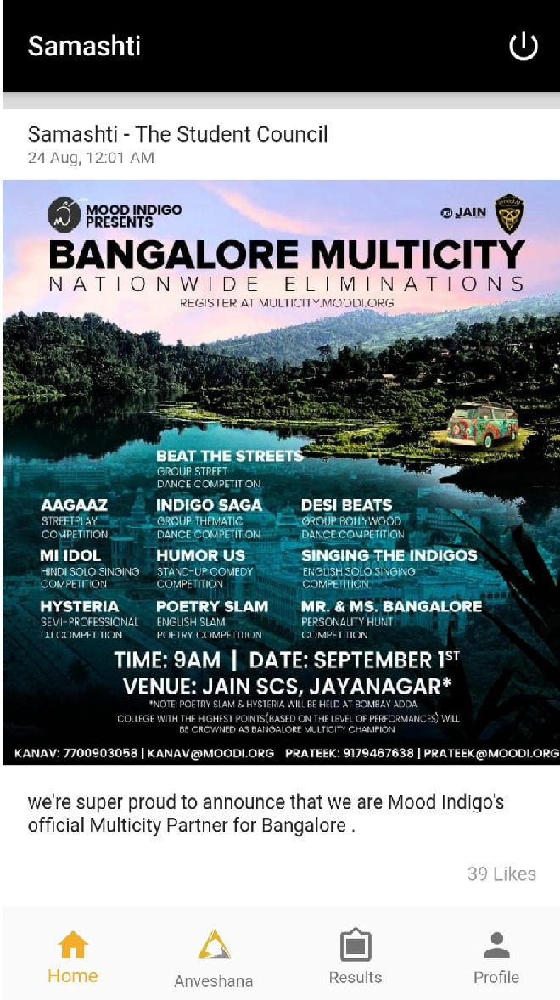
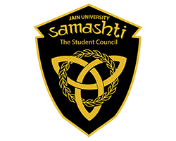

# Anveshana 2019
#### Samashti - The Student Council official app.

The app is developed to allow user to login and check his/her upcoming events. New students can be able to register to events through app. Events are organized by Forum (Samashti).

[Check it out on Google Play Store.](https://play.google.com/store/apps/details?id=in.co.samashti.samashti_app)

***
### About app.
Following are few features that app provides for students.
* Notify about the event and it's venue and timing using Firebase cloud messaging.
* Load the events data throug API and display to user.
* Profile managment for user allowing them to update basic information.
* Registration for events with single click.

***
### About Samashti
Samashti - The Student Council is the student governing body of Jain University. It is the culmination of management, cultural and tech enthusiasts. Our motto is to ‘Conquer from within’. We provide a hub for every student of the college who wishes to explore knowledge outside the books. We also provide a magnificent platform for individuals to showcase their talents and help them grow to become the best version of themselves. Samashti is the driving force behind organizing ‘Anveshana’ - an intra college fest for freshers, ‘Tarusamskruti’ - a national level intercollegiate fest and ‘Pulse’ – an exclusive national level dance fest.

[Samashti - The Student Council.](https://samashti.co.in)

***
